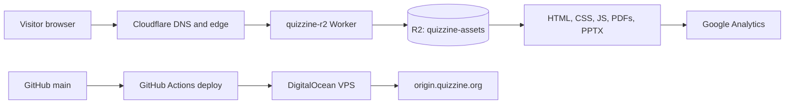

# Quizzine

[Quizzine](https://quizzine.org) is a searchable library of quiz presentations from **Quiz Club - VSSUT Burla**. Browse decks across technology, business, India, sport, culture, and more; open a rendered, mobile-friendly slide viewer; or download the original presentation.

## What is included

- Typeahead search and topic filters for the quiz catalogue.
- Administrator upload page for `.ppt` and `.pptx` decks, with persistent quizmaster, year, and optional social-handle metadata.
- A responsive PDF.js slide reader with explicit Previous and Next controls.
- Original PowerPoint downloads for every quiz deck.
- Open Graph and Twitter metadata for link previews.
- Google Analytics via measurement ID `G-WMMW5VG9YV`.

## System design



The public `quizzine.org` and `www.quizzine.org` hostnames are routed through Cloudflare. The `quizzine-r2` Worker serves the published static site and quiz assets from the `quizzine-assets` R2 bucket, with Cloudflare providing the global edge layer.

The DigitalOcean VPS keeps a deployed copy of the site and exposes `origin.quizzine.org` through Nginx. It also runs the small upload API, which stores uploaded decks under `public/uploads/` and metadata in `data/quizzes.json`. The static library fetches that metadata from the origin, so newly uploaded quizzes show on the public home page without a static-site release. The Nginx configuration is kept in [`infra/nginx/quizzine.org.conf`](infra/nginx/quizzine.org.conf).

### Viewer flow

1. A visitor selects a card from the catalogue.
2. `viewer.html` resolves the quiz metadata from `quizzes.js`.
3. PDF.js loads the matching rendered PDF from `public/quizzes/viewer/` and paints the current page on a canvas.
4. Previous and Next update the rendered page; the original `.pptx` remains available through the download button.

## Deployment

Every push to `main` runs [`.github/workflows/deploy.yml`](.github/workflows/deploy.yml). The workflow syncs the web source, assets, and Nginx configuration to the DigitalOcean VPS over SSH, then invokes the configured deploy command.

Configure these repository secrets:

- `QUIZZINE_VPS_HOST`
- `QUIZZINE_VPS_USER`
- `QUIZZINE_VPS_SSH_KEY`
- `QUIZZINE_VPS_PATH` — for example, `/var/www/quizzine`
- `QUIZZINE_VPS_DEPLOY_COMMAND` — for example, `sudo systemctl reload nginx`
- `QUIZZINE_UPLOAD_TOKEN` — a strong administrator-only secret required by `upload.html`

For a full public release, publish the same changed static files and quiz assets to the `quizzine-assets` R2 bucket, then purge only the affected Cloudflare URLs when cached HTML, CSS, or JavaScript has changed.

## Local development

Run the API and serve the site from the repository root:

```bash
QUIZZINE_UPLOAD_TOKEN=local-dev-token python3 server.py
python3 -m http.server 8000
```

Then visit `http://localhost:8000`. The upload page calls the production origin by default; for local upload testing, start the server on port 8081 and use an origin override in your browser/dev tooling.
