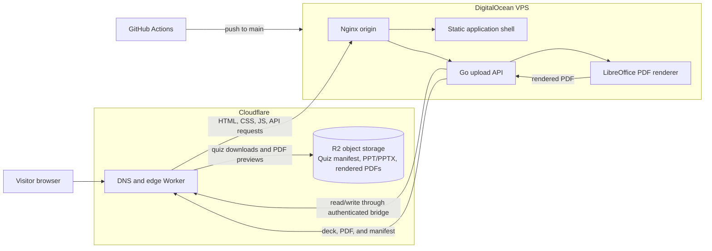

# Quizzine

[Quizzine](https://quizzine.org) is a searchable library of quiz presentations from **Quiz Club - VSSUT Burla**. Browse decks across technology, business, India, sport, culture, and more; open a rendered, mobile-friendly slide viewer; or download the original presentation.

## What is included

- Typeahead search and topic filters for the quiz catalogue.
- Public upload page for `.ppt` and `.pptx` decks, with persistent quizmaster, year, and optional social-handle metadata.
- A responsive PDF.js slide reader with explicit Previous and Next controls.
- Original PowerPoint downloads for every quiz deck.
- Open Graph and Twitter metadata for link previews.
- Google Analytics.

## System design



The public site is routed through Cloudflare. Its Worker sends the application shell and API requests to the Nginx origin on the DigitalOcean VPS, while quiz downloads and rendered PDF previews are served from R2.

The VPS runs Nginx, the static application shell, and the Go upload API. The API validates uploads, prevents duplicate deck binaries with SHA-256, renders a PDF with LibreOffice, and writes the original deck, rendered PDF, and quiz manifest to R2 through an authenticated Worker-only bridge. The catalogue fetches its uploaded-quiz metadata from the API, so new uploads appear without a static-site deployment. The Nginx configuration is kept in [`infra/nginx/quizzine.org.conf`](infra/nginx/quizzine.org.conf).

### Viewer flow

1. A visitor selects a card from the catalogue.
2. `viewer.html` resolves the quiz metadata from `quizzes.js`.
3. PDF.js loads the matching rendered PDF from Cloudflare R2 and paints the current page on a canvas.
4. Previous and Next update the rendered page; the original `.pptx` remains available through the download button.

## Deployment

Every push to `main` runs [`.github/workflows/deploy.yml`](.github/workflows/deploy.yml). The workflow builds the Go API, syncs the web source, bundled assets, and Nginx configuration to the DigitalOcean VPS over SSH, activates the API, and reloads the web server. Deployment credentials and runtime configuration are intentionally private and are not documented here.

Quiz uploads are persisted to R2 by the running API. Changes to Cloudflare Worker code, R2-backed assets, or Cloudflare cache policy are a separate Cloudflare release boundary and should be published and verified there.

## Local development

Serve the site from the repository root with a local static server. To exercise uploads locally, run the Go API with private local storage-bridge configuration.

```bash
python3 -m http.server 8000
```

Then visit `http://localhost:8000`.
